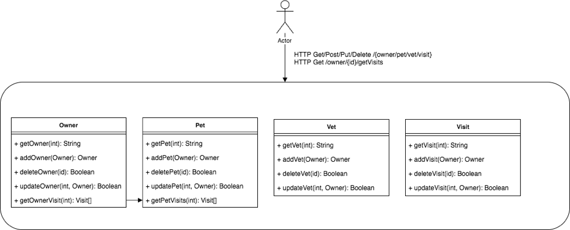

# Pet Clinic App - A Microservices based Capstone Project

This project is an example of Live Project of DevOps where automation is the key.

## A high level architecture of Pet Clinic App




## Solution Diagram


## Advantages of  Microservices?

__Isolation of crashes:__ Even the best engineering organizations can and do have fatal crashes in production. In addition to following all the standard best practices for handling crashes gracefully, one approach that can limit the impact of such crashes is building microservices. Good microservice architecture means that if one micro piece of your service is crashing then only that part of your service will go down. The rest of your service can continue to work properly.

__Isolation for security:__ In a monolithic application if one feature of the application has a security breach, for example a vulnerability that allows remote code execution then you must assume that an attacker could have gained access to every other feature of the system as well. This can be dangerous if for example your avatar upload feature has a security issue which ends up compromising your database with user passwords. Separating out your features into micorservices using EC2 Container Service allows you to lock down access to AWS resources by giving each service its own IAM role. When microservice best practices are followed the result is that if an attacker compromises one service they only gain access to the resources of that service, and can't horizontally access other resources from other services without breaking into those services as well.

__Independent scaling:__ When features are broken out into microservices then the amount of infrastructure and number of instances of each microservice class can be scaled up and down independently. This makes it easier to measure the infrastructure cost of particular feature, identify features that may need to be optimized first, as well as keep performance reliable for other features if one particular feature is going out of control on its resource needs.

__Development velocity__: Microservices can enable a team to build faster by lowering the risk of development. In a monolith adding a new feature can potentially impact every other feature that the monolith contains. Developers must carefully consider the impact of any code they add, and ensure that they don't break anything. On the other hand a proper microservice architecture has new code for a new feature going into a new service. Developers can be confident that any code they write will actually not be able to impact the existing code at all unless they explictly write a connection between two microservices.


## Local Build and deployment Process

This is the build process that you can follow to manually compile and run the app. This process needs to be automated.

```
	git clone https://dsa-devops@bitbucket.org/dsa-devops/live-project.git
	cd spring-petclinic-rest-pet
	mvn package 
        ls target/                                  
        java -jar target/spring-petclinic-rest-pet-1.5.2.RELEASE.jar
```

** Do remember you have to individually build every single microservice, above code only shows you how to compile one microservice.

You can then access petclinic here: http://localhost:8080/

### Notes

** Do not run the builds against this repository, you should upload the code to your own github or Bitbucket repository. One important thing to note here is that each microservice should have their individual repository, else you will not be able to deploy microservices independently.

### Tips
1. Make sure your Jenkins server is your Ansible Control Node and Teraform is also configured on the same server.
2. Sample Dockerfile

```
	FROM adoptopenjdk/openjdk11-openj9:alpine-jre
	VOLUME /tmp
	ARG JAR_FILE
	COPY ${JAR_FILE} /app.jar
	CMD ["java", "-jar", "/app.jar"]
```
